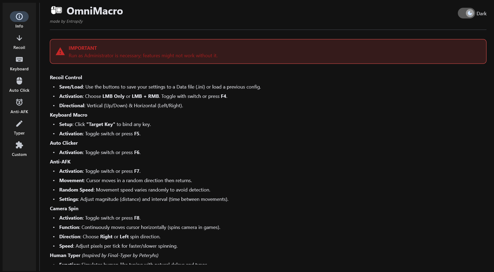
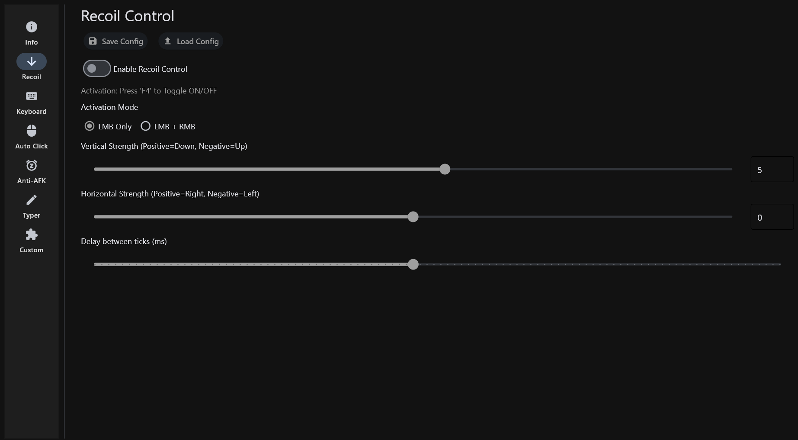
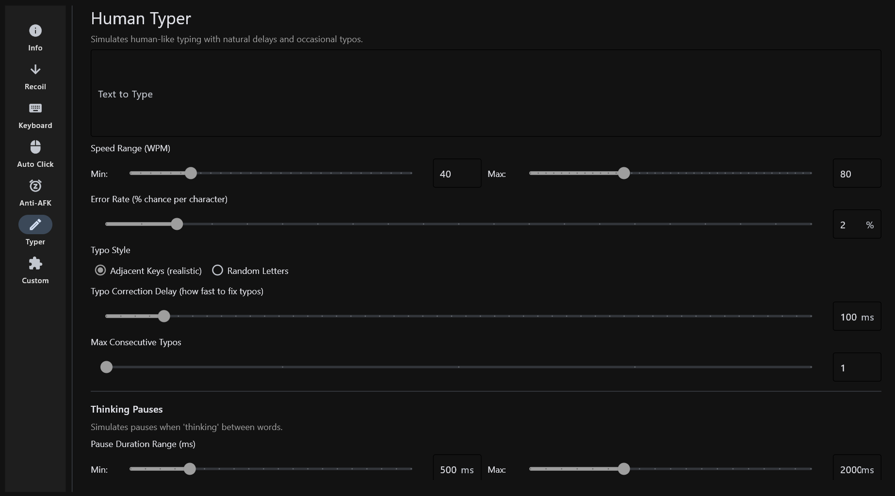

<p align="center">
  
</p>

<h1 align="center">OmniMacro</h1>

<p align="center">
  <strong>A powerful, feature-rich automation tool for Windows</strong>
</p>

<p align="center">
  
  
  
  <br/>
  
  
  
  
  
  <br/>
  
  
</p>

---

## Overview

**OmniMacro** is a comprehensive Windows automation utility designed for power users and those who want to save effort and time on daily tasks. It combines multiple automation features into a single, intuitive interface with a modern, sleek theme.

> ⚠️ **Important**: If certain features don't work as intended, </strong>run as administrator</strong> for full functionality.

---

## Features

### Human Typer
A sophisticated typing simulator that mimics human behavior:

| Feature | Description |
|---------|-------------|
| **Speed Range** | Variable WPM (10-300) for realistic variation |
| **Typo Simulation** | Adjacent keys or random letters with auto-correction |
| **Synonym Swap** | Types synonym first, then corrects to intended word |
| **Correction Delay** | Configurable pause before fixing typos (20-1000ms) |
| **Multi-Typos** | Simulate multiple consecutive errors (smart limit based on word position) |
| **Thinking Pauses** | Random pauses between words (0-50% frequency) |
| **Sentence Pauses** | Pauses after `.!?` with configurable frequency |
| **Paragraph Pauses** | Pauses after newlines with configurable frequency |
| **Special Char Delay** | Pauses 500-1500ms before typing symbols (simulates looking for keys) |
| **Emotion Simulator** | Crashout (rage spam), Nihilism (existential phrases), Vamp (Carti lyrics) - triggers after 20%, won't happen back-to-back |
| **Auto-Pause on Click** | Typing pauses if mouse clicked (prevents wrong location typing) |
| **Type-Along Mode** | Types only while you actively press keys; keystrokes blocked so only intended text appears. Typos & Emotion Simulator remain active. |
| **Resume** | Continue typing from exact position with 3-second countdown |


> **Synonym Dictionary**: Built-in dictionary with **200+ common words** including verbs, adjectives, nouns, and adverbs.

### Recoil Control
- **Vertical & Horizontal compensation** with adjustable strength
- **LMB Only** or **LMB + RMB** activation modes
- **Fine-tuning** with decimal precision (0.1 increments)
- **Save/Load** configuration profiles
- **Hotkey**: `F4`

### Keyboard Macro
- Bind any key for **rapid-fire** repeating
- Adjustable **delay** between key presses
- **Hotkey**: `F5`

### Auto Clicker
- Adjustable **click interval** (1-1000ms)
- **Hotkey**: `F6`

### Anti-AFK
- **Random direction** cursor movement with return
- **Variable speed** to avoid detection
- Adjustable **magnitude** and **interval**
- **Hotkey**: `F7`

### Camera Spin
- **Continuous horizontal** cursor movement
- **Left/Right** direction selection
- Adjustable **speed** (pixels per tick)
- **Hotkey**: `F8`

### Custom Macros
- **Unlimited** custom macro slots
- Bind **keyboard keys** or **mouse buttons** as triggers
- **Multi-key actions** - press multiple keys simultaneously
- **Hold-to-repeat** functionality
- **Persistent storage** - macros saved across sessions

### Crosshair Overlay
- **Always-on-top** transparent overlay — works over borderless fullscreen and windowed apps
- **Click-through** — crosshair is fully transparent to mouse clicks
- **Shapes**: Cross, Circle, Dot, Cross+Circle, Cross+Dot
- **Color presets** (Green, Red, Cyan, White, Yellow, Magenta, Orange) or **custom RGB**
- **Adjustable**: Size (2-50px), Thickness (1-5px), Opacity (10-100%), Gap (0-20px)
- **Center Dot** and **Dark Outline** toggles for visibility
- **Hotkey**: `F9`

### Screen OCR (Text Capture)
- **Region capture** — click and drag to select any area of the screen
- **OCR text extraction** using Tesseract OCR (bundled in the exe)
- **Editable Output Box** — extracted text populates a modifiable text area for quick edits before copying
- **Copy to clipboard** with one click
- **Capture history** — last 20 captures stored with timestamps
- **Dimmed overlay** with instructions during capture
- **Cancel** with ESC or right-click
- **Hotkey**: `F10`

### Color Clicker
Monitors a user-defined screen region and automatically left-clicks when a target color is detected:

| Feature | Description |
|---------|-------------|
| **Region Selector** | Draw a rectangle on screen to define the area to monitor (app minimizes for a clean view) |
| **Eyedropper** | Full-screen overlay with live magnifier — click any pixel to pick its color |
| **Hex Input** | Type any `#RRGGBB` hex code directly; syncs two-way with the eyedropper swatch |
| **Color Tolerance** | Euclidean RGB distance matching (0 = exact, 150 = very loose) |
| **Pre-Click Delay** | Configurable delay (0–5000ms) between color detection and the actual click |
| **Scan Interval** | Control how often the region is sampled (10–1000ms); lower = more responsive |
| **Preset Click Position** | Optionally click at a fixed screen coordinate instead of the current cursor — set via an on-screen point picker; cursor returns to its original position after each click; works cross-monitor |
| **Cooldown** | Built-in 300ms cooldown between clicks prevents spam |
| **Hotkey** | `F11` to toggle on/off |

---

## Tech Stack

| Component | Technology |
|-----------|------------|
| **Language** | Python 3.12+ |
| **GUI Framework** | [Flet](https://flet.dev/) (Flutter-based) |
| **Input Handling** | [pynput](https://pypi.org/project/pynput/) |
| **OCR Engine** | [Tesseract OCR](https://github.com/tesseract-ocr/tesseract) (bundled) |
| **Image Processing** | [Pillow](https://python-pillow.org/) |
| **Screen Overlays** | [Tkinter](https://docs.python.org/3/library/tkinter.html) (region selector & eyedropper) |
| **Packaging** | [PyInstaller](https://pyinstaller.org/) |
| **OS Integration** | Windows API (ctypes) |

---

## Installation

### Option 1: Download Release (see I actually package into .exe because I'm nice, unlike some people...)
- Download the latest `OmniMacro.zip` from the [Releases](../../releases) page.
- Unzip the .zip file to any location on your computer. Ensure both the OmniMacro.exe and the configs folder are in the same folder. Run the .exe (preferably as administrator).

### Option 2: Build from Source

```bash
# Clone the repository
git clone https://github.com/Entropify/OmniMacro.git
cd OmniMacro

# Create virtual environment
python -m venv venv
venv\Scripts\activate

# Install dependencies
pip install -r requirements.txt

# Install Tesseract OCR (required for Screen OCR feature and building the exe)
# Download from: https://github.com/UB-Mannheim/tesseract/wiki
# Or via winget:
winget install UB-Mannheim.TesseractOCR

# Run directly
python main.py

# Or build executable (Tesseract is automatically bundled into the exe)
pyinstaller OmniMacro.spec --noconfirm
```

> **Note for developers**: Tesseract OCR must be installed on your build machine (default: `C:\Program Files\Tesseract-OCR\`). The spec file auto-detects it and bundles the binary + English training data into the single exe. End users do **not** need to install Tesseract separately.

> **Exe size**: The compiled `.exe` is ~170 MB (up from ~80 MB) because Tesseract OCR and its dependencies (ICU unicode libraries, Leptonica image processing, etc.) are fully bundled. This ensures the OCR feature works out-of-the-box with no separate installs needed.

---

## Project Structure

```
OmniMacro/
├── main.py                  # GUI application and UI logic
├── macro_core.py            # Core automation engine
├── input_utils.py           # Low-level Windows input utilities
├── crosshair_overlay.py     # Win32 crosshair overlay window
├── screen_ocr.py            # Screen region capture and OCR
├── color_picker_overlay.py  # Region selector and eyedropper tool
├── OmniMacro.spec           # PyInstaller build configuration
├── requirements.txt         # Python dependencies
├── assets/
│   └── icon.ico             # Application icon
└── dist/
    └── OmniMacro.exe        # Compiled executable
```

---

## Usage

1. **Launch** `OmniMacro.exe` as Administrator
2. **Navigate** using the sidebar tabs
3. **Configure** your desired features
4. **Activate** using toggle switches or hotkeys
5. **Save** your settings for future sessions

### Hotkey Reference

| Key | Function |
|-----|----------|
| `F4` | Toggle Recoil Control |
| `F5` | Toggle Keyboard Macro |
| `F6` | Toggle Auto Clicker |
| `F7` | Toggle Anti-AFK |
| `F8` | Toggle Camera Spin |
| `F9` | Toggle Crosshair Overlay |
| `F10` | Capture Screen Region (OCR) |
| `F11` | Toggle Color Clicker |

---

## Screenshots

<p align="center">
  
  
</p>
<p align="center">
  
</p>

The application features a modern **dark theme** with:
- Clean navigation rail
- Intuitive sliders and toggles
- Real-time setting updates
- Smooth animations

---

## License

This project is licensed under the **Apache License 2.0** - see the [LICENSE](LICENSE) file for details.

```
Copyright 2024 Entropify

Licensed under the Apache License, Version 2.0 (the "License");
you may not use this file except in compliance with the License.
You may obtain a copy of the License at

    http://www.apache.org/licenses/LICENSE-2.0

Unless required by applicable law or agreed to in writing, software
distributed under the License is distributed on an "AS IS" BASIS,
WITHOUT WARRANTIES OR CONDITIONS OF ANY KIND, either express or implied.
See the License for the specific language governing permissions and
limitations under the License.
```

---

## Credits & Acknowledgments

- **[Final-Typer](https://github.com/Peteryhs/Final-Typer)** by Peteryhs - Inspiration for the Human Typer feature
- **[Tesseract OCR](https://github.com/tesseract-ocr/tesseract)** - Open-source OCR engine
- **[Flet](https://flet.dev/)** - Modern Python UI framework
- **[pynput](https://pynput.readthedocs.io/)** - Cross-platform input control

---

## Disclaimer

This software is provided for **educational and personal use only**. The author is not responsible for any misuse of this tool. Use responsibly and in accordance with the terms of service of any applications or games you interact with.

---

<p align="center">
  Made with ❤️ by <strong>Entropify</strong>
</p>
